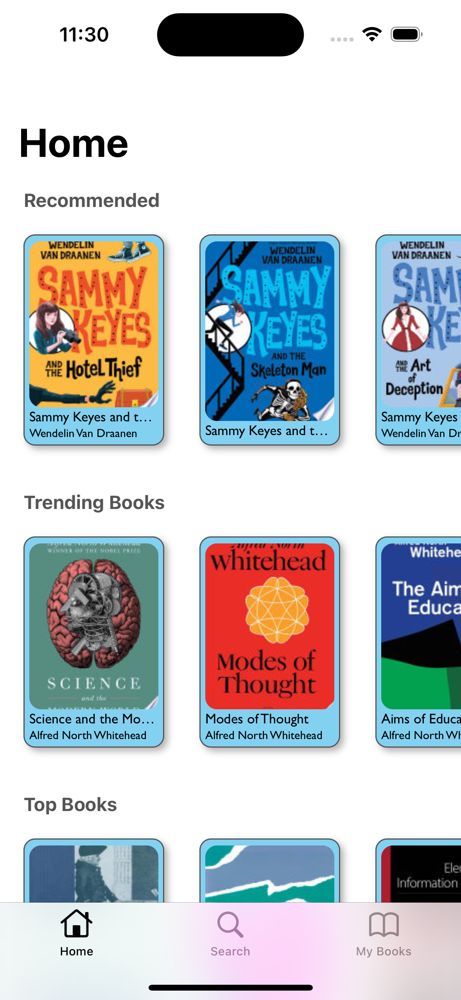
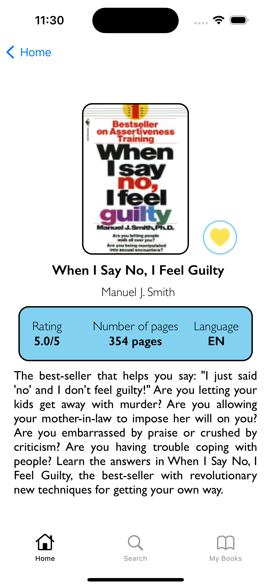
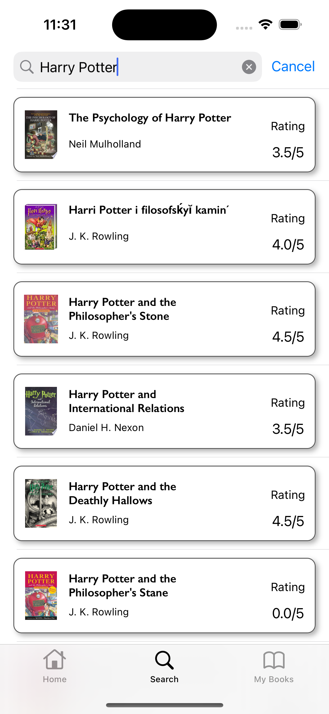

# EBook App

 

- **All data is fetched from API:** [Google Books API](https://developers.google.com/books) 
___

## About
A simple Book Search App using the public API.

 - Home screen - shows a list of recommended books.
 - Detail screen - shows information about the selected book.
 - Search screen - search for books by title or author.
 - My Books screen - shows a list of books that the user marked as favorites. 

## Features
- UI Framework: UIKit
- Architecture pattern: MVVM
- Favorite list using User Defaults

## Third Party Libraries

- **[SDWebImage](https://github.com/SDWebImage/SDWebImage):** For handling downloading, displaying and caching photos given an url.
